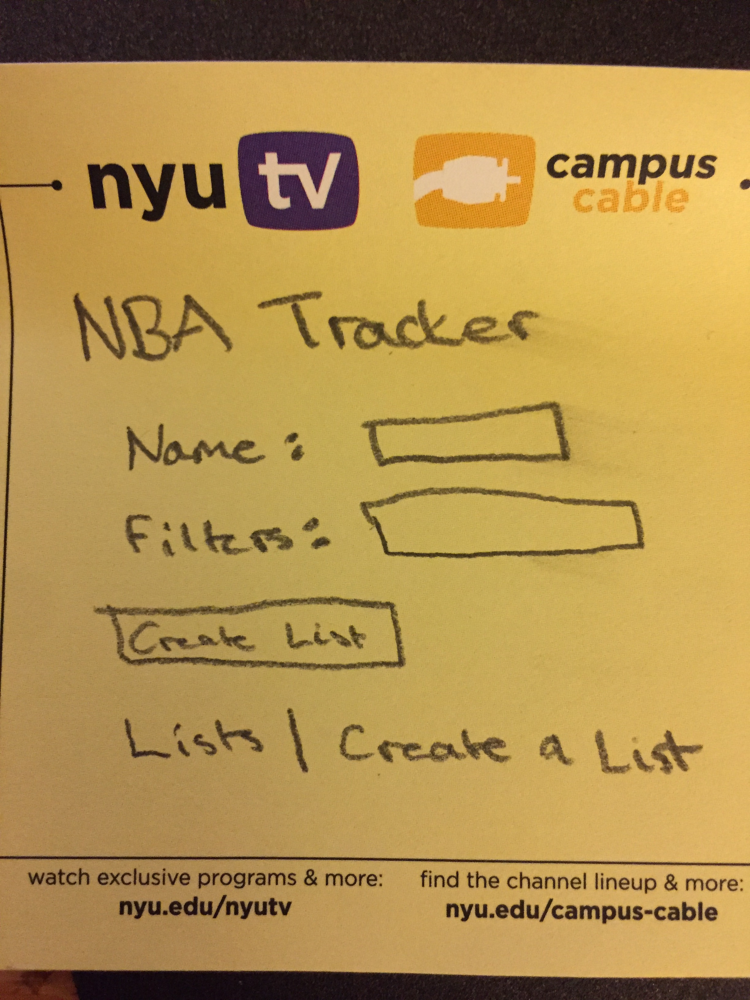
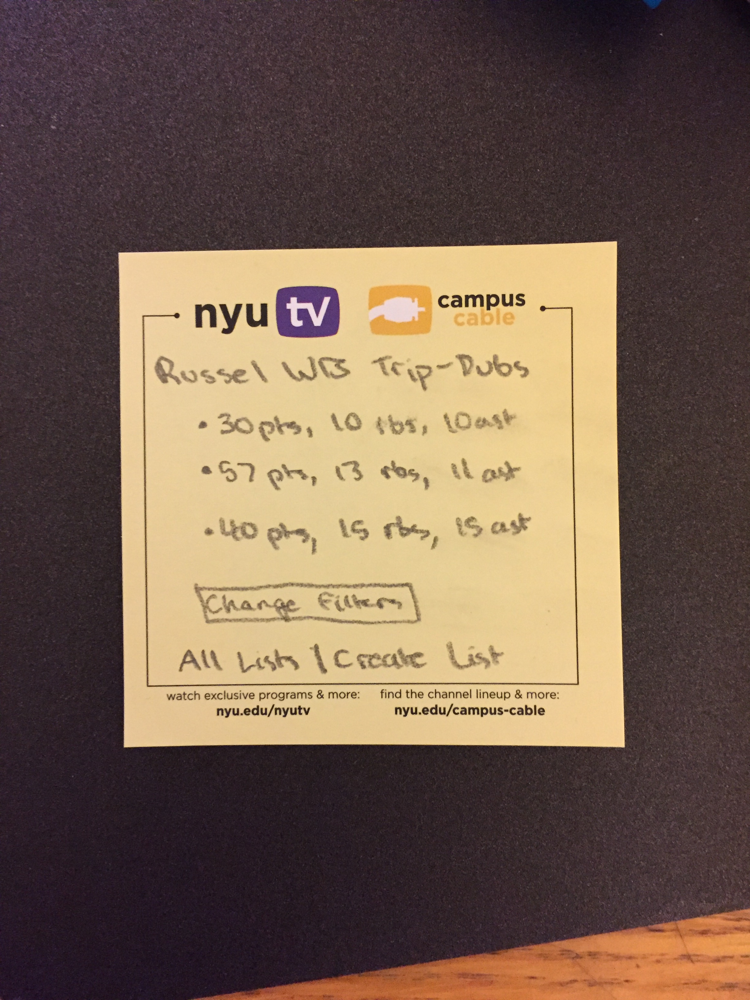
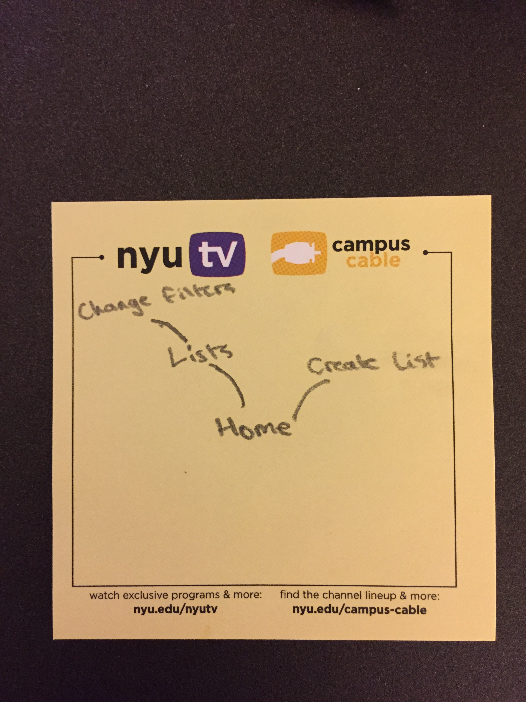

The content below is an example project proposal / requirements document. Replace the text below the lines marked "__TODO__" with details specific to your project. Remove the "TODO" lines.


# NBA Tracker 

## Overview

There are too many games to keep track of each day! I'm too busy to watch all the games, but I still love being updated with impressive statlines. NBA Tracker is a highly customizable app that allows users to save player game logs from each day. A user will have flexible options on which game logs to save. They can save according to player and/or restrictions in the statline (for ex: points > 30, rebounds > 10, assists > 10). These game logs will be saved to a list that accumulates them as the season goes on. NBA tracker will allow users to register and login to view their updated lists and to add or change restrictions to their lists.


## Data Model

The application will store Users, Lists and Logs

* users can have multiple lists
* each list can have multiple player game logs

(___TODO__: sample documents_)

An Example User:

```javascript
{
  username: "NBATracker",
  hash: // a password hash,
  lists: // an array of references to List documents
}
```

An Example List with Embedded Logs:

```javascript
{
  user: // a reference to a User object
  name: "Russell Westbrook Triple Doubles",
  logs: [
    { player: "Russell Westbrook", date: "01/29/2017", points: 40},
    { player: "Russell ", date: "3/29/2017", points: 57},
  ],
  createdAt: // timestamp
}
```


## [Link to Commented First Draft Schema](db.js) 

jjl625-final-project/db.js

## Wireframes

(___TODO__: wireframes for all of the pages on your site; they can be as simple as photos of drawings or you can use a tool like Balsamiq, Omnigraffle, etc._)

/list/create - page for creating a new shopping list



/list - page for showing all shopping lists


/list/slug - page for showing specific shopping list



## Site map



## User Stories or Use Cases

1. as non-registered user, I can register a new account with the site
2. as a user, I can log in to the site
3. as a user, I can create a new list based on filters
4. as a user, I can view all of the lists I've created in one single list
5. as a user, I can change the filters of an existing list

## Research Topics

* (5 points) Integrate user authentication
    * I will use FB Connect to implement user authentication
* (2 points) Use external API NBA Stats
    * I will use this API to search for stats and filter them out into lists
* (2 points) CSS Framework
    * I will use bootstrap and foundation to spice up the site

9 points total out of 8 required points


## [Link to Initial Main Project File](app.js) 

(___TODO__: create a skeleton Express application with a package.json, app.js, views folder, etc. ... and link to your initial app.js_)

## Annotations / References Used
